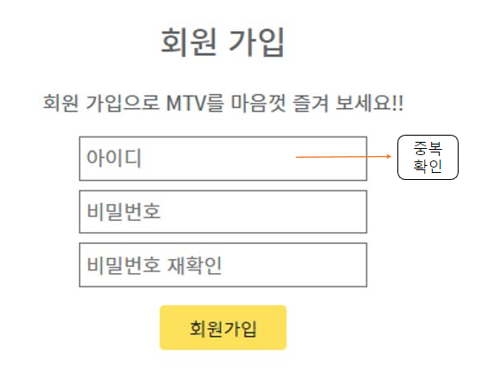
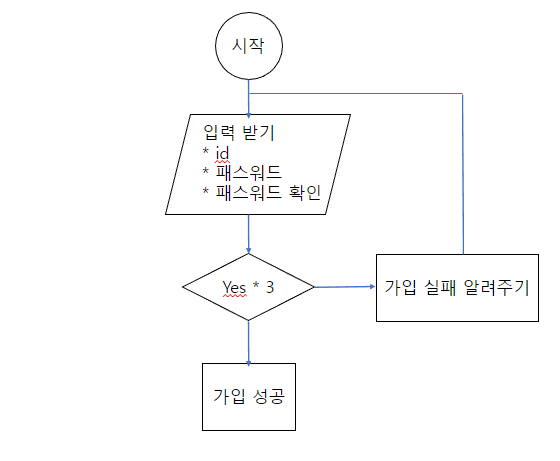
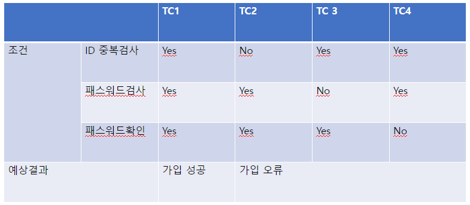
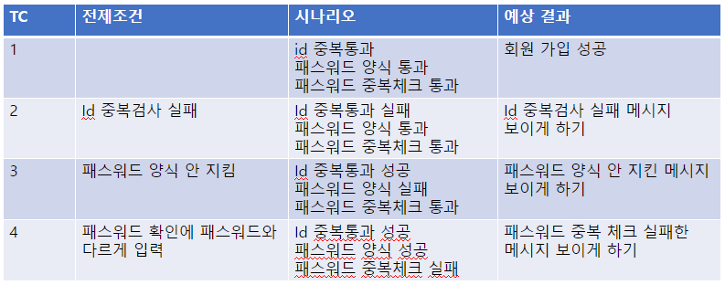
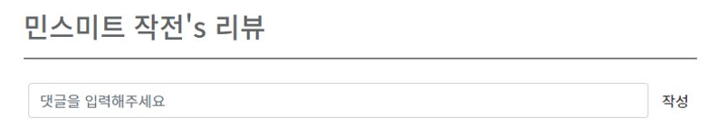
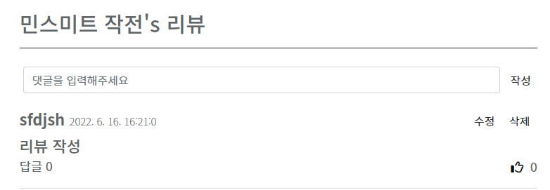
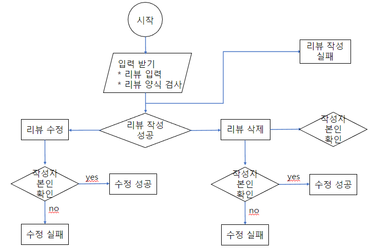
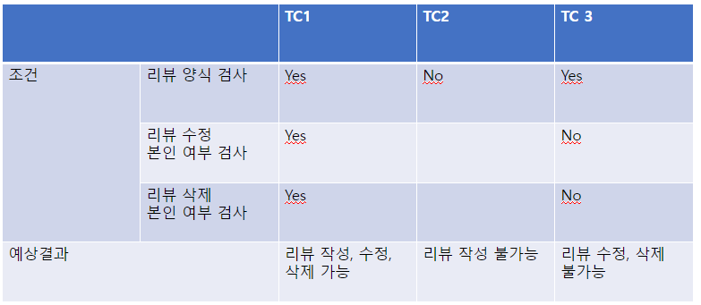
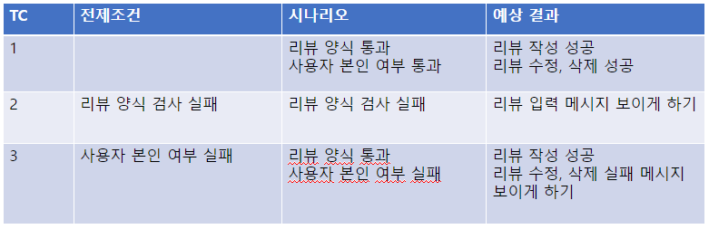

### 테스트 케이스

**회원가입 페이지**

\-	회원가입 화면

\-	제어 흐름도

\-	케이스 (논리 케이스) : 결정 테이블

\-	최종 케이스 완성 및 수행

**영화 리뷰 작성**

\-	영화 리뷰 작성 화면

\-	리뷰 작성 성공 화면

\-	제어 흐름도

\-	케이스 (논리 케이스) : 결정 테이블

\-	최종 케이스 완성 및 수행

