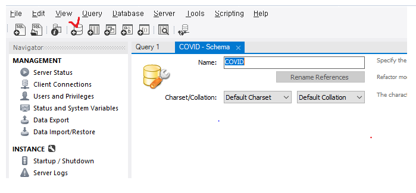
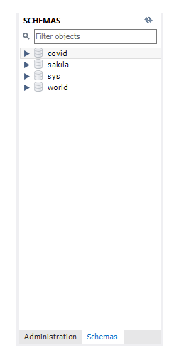
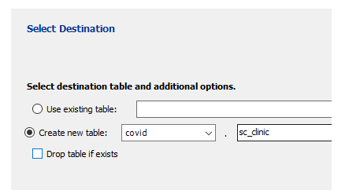
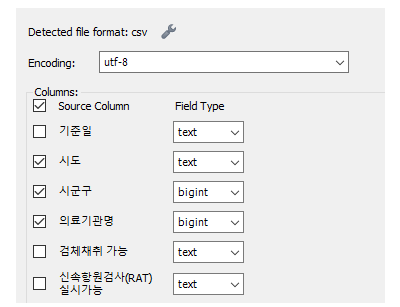
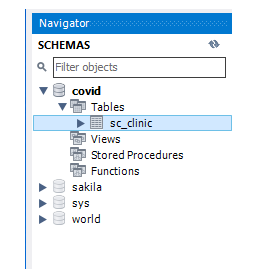
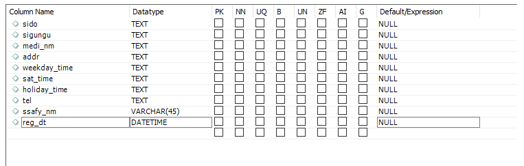
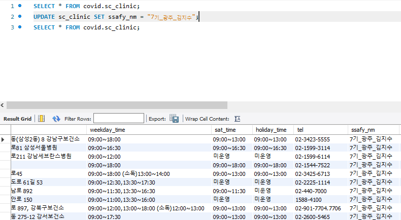
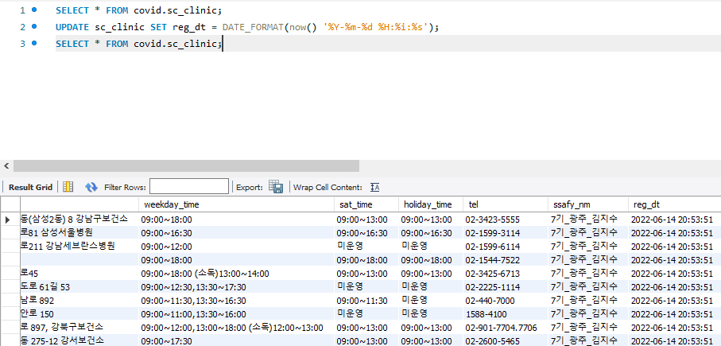

### 필수3. MYSQL/MariaDB data processing




위 버튼을 클릭하면 스키마를 생성할 수 있다.




그럼 좌측 부분에 Schemas를 클릭하면 스키마가 생성된 것을 볼 수 있는데 covid를 우클릭하여 

Table Data Import Wizard를 클릭하면 데이터를 넣을 수 있다.

```
주의사항)
MySQL은 csv, json파일만 읽을 수 있으므로, 해당 엑셀 파일 가공을 해주어야 한다.
따라서 해당 엑셀 파일에 들어가서 .csv파일로 따로 저장해주어야 한다.
```





가공을 해주었으면 위와 같이 새로운 테이블을 만들 이름을 설정해준다.




데이터의 필드 타입과 필요한 컬럼들을 지정해준다.






sc_clinic의 번개모양을 클릭하면 테이블을 수정할 수 있다. 본인은 테이블을 위와 같은 이미지로 수정하였다.





쿼리문 작성후 쿼리문 상단에 있는 번개 모양을 눌러주면 쿼리문에 따라 테이블에 적용된다.




red_gt 또한 2번째 줄 쿼리문을 통하여 바꿀 수 있다.


sc_clinic을 우클릭하여 Table Data Export Wizard를 클릭하면 csv 또는 json 파일로 스키마를 내보낼 수 있다.
